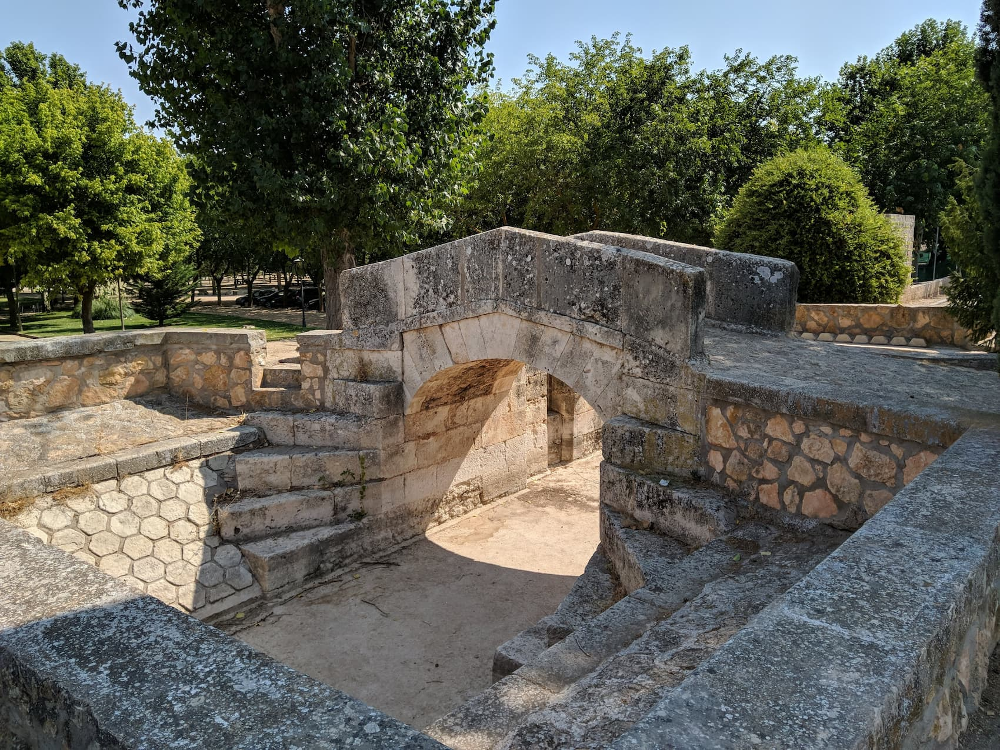

# Bienvenido a alamedadecervera.com 🏡

Este proyecto es una página web desarrollada con el objetivo de proporcionar información sobre el encantador pueblo de Alameda de Cervera en Ciudad Real, España.

## ¿Qué encontrarás en esta web? 📖

- Información general sobre Alameda de Cervera, su ubicación, historia y características.
- Lugares de interés turístico, como la Ermita de San Lorenzo, el puente del Gran Prior, el Castillo de la Estrella y el parque de D. Ramón Fernández Urrutia.
- Datos útiles para los visitantes, como alojamiento, autobuses, bares y actividades recomendadas en la zona.
- Galería de imágenes con fotos del pueblo y sus alrededores.

## Tecnologías utilizadas 🛠️

- [Astro](https://astro.build/) - Un moderno y rápido framework de construcción de sitios web estáticos.
- [Preact](https://preactjs.com/) - Una biblioteca de interfaz de usuario rápida y eficiente.
- [Tailwind CSS](https://tailwindcss.com/) - Un framework de diseño centrado en clases para crear interfaces de usuario modernas y personalizables.
- [StandardJS](https://standardjs.com/) - Un estilo de codificación y linter para JavaScript.
- [Prettier](https://prettier.io/) - Una herramienta de formateo de código para mantener el código limpio y legible.

## Ejecución local 💻

Si deseas ejecutar este proyecto localmente, sigue estos pasos:

1. Clona este repositorio en tu máquina local.
2. Instala las dependencias con el comando `npm install`.
3. Ejecuta el servidor de desarrollo con el comando `npm run dev`.
4. Abre tu navegador y visita `http://localhost:3000` para ver la web en acción.

## Contribuciones y colaboración 👋

¡Eres bienvenido/a a contribuir a este proyecto! Si tienes ideas, correcciones o mejoras, siéntete libre de hacer un "fork" del repositorio y abrir una solicitud de extracción. Estamos abiertos a colaboraciones para hacer de esta web una fuente de información aún mejor sobre Alameda de Cervera.
